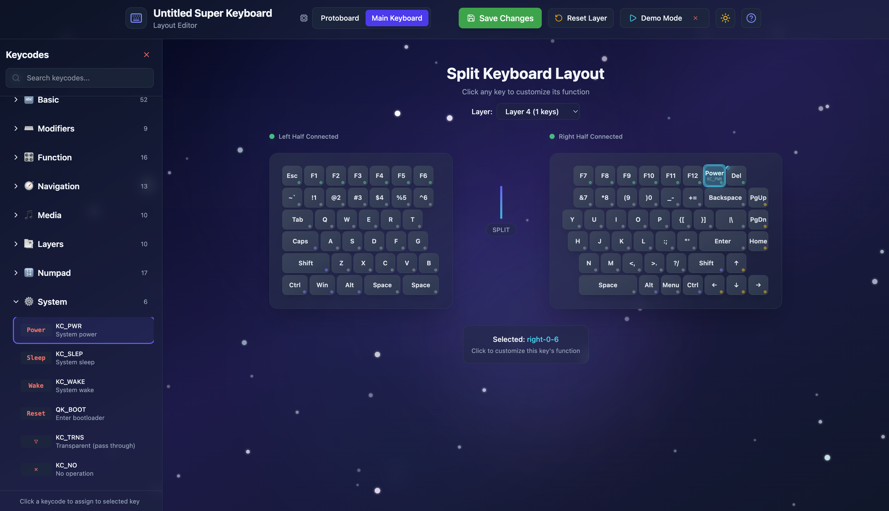
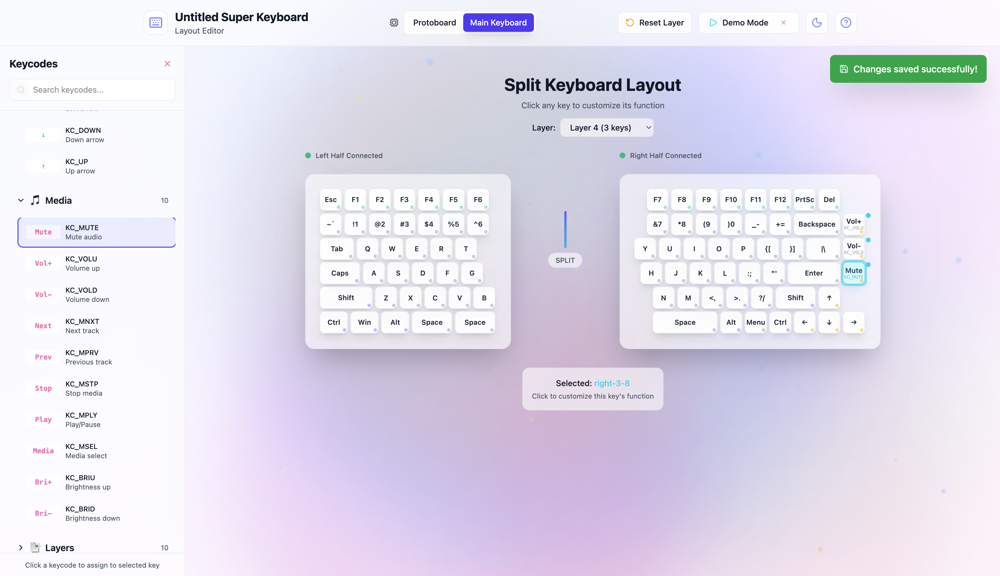
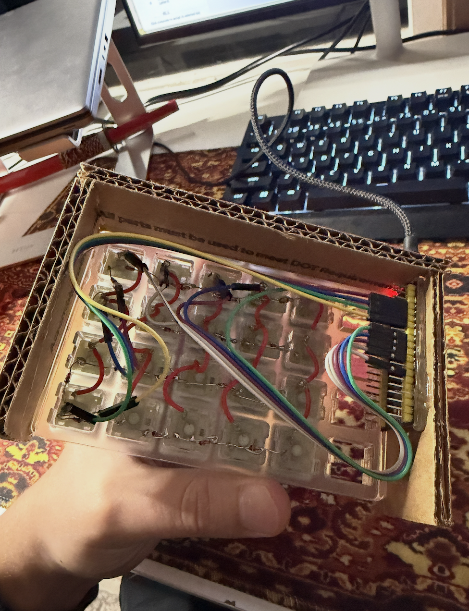

# Untitled Super Keyboard

A custom split mechanical keyboard with a web-based layout editor. Designed and built from scratch - PCB schematics, 3D-printed chassis, QMK firmware, and a React configurator that talks to the hardware over WebHID.



## Layout Editor

The layout editor is a browser-based GUI for remapping keys on the keyboard without recompiling firmware. It communicates with the keyboard directly over USB using the WebHID API and VIA protocol.



### Features

- **Visual key mapping** - click any key on the split layout, then pick a keycode from the sidebar to assign it
- **5 layers** - stack multiple keymaps and switch between them (base, function, media, navigation, etc.)
- **130+ keycodes** - organized by category: basic, modifiers, function, navigation, media, layer controls, numpad, system
- **Live hardware sync** - reads the current keymap from the keyboard and writes changes back over USB
- **Demo mode** - test the editor without hardware connected
- **Dark/light theme** - persisted in localStorage
- **Two hardware targets** - switch between the main 8x8 matrix keyboard and the 4x5 protoboard for testing

### Tech

- React 19 + TypeScript
- Vite
- Tailwind CSS
- Framer Motion
- WebHID API + VIA protocol

### Running the editor

```bash
cd untitled-super-layout-editor
npm install
npm run dev
```

Open http://localhost:5173. Use Chrome or Edge (WebHID requires a Chromium browser). Click "Demo Mode" to test without hardware.

## Hardware



The full project includes everything needed to build the keyboard from scratch:

| Component | Details |
|-----------|---------|
| PCB | Custom split design, RP2040-based, 8x8 key matrix per half |
| Firmware | QMK with VIA support for dynamic keymap editing |
| Chassis | 3D-printed enclosure (STL + Fusion 360 source files) |
| Schematics | KiCad PCB layouts for left/right main boards and sub-boards |
| Protoboard | Simplified 4x5 test boards for firmware development |

### Project structure

```
Senior-Project/
  untitled-super-layout-editor/   # Web-based layout editor (React)
  untitled_super_keyboard/        # QMK firmware - left half
  untitled_super_keyboard_right/  # QMK firmware - right half
  untitled_super_keyboard_numpad/ # QMK firmware - numpad variant
  protoboard_left/                # QMK firmware - test board (left)
  protoboard_right/               # QMK firmware - test board (right)
  Keyboard Schematics and PCB/    # KiCad PCB design files
  Keyboard Chassis Final v5.f3d   # Fusion 360 CAD model
  Keyboard BuildPlate v*.stl      # 3D print files
  SCH_*.pdf                       # Schematic PDFs
```
